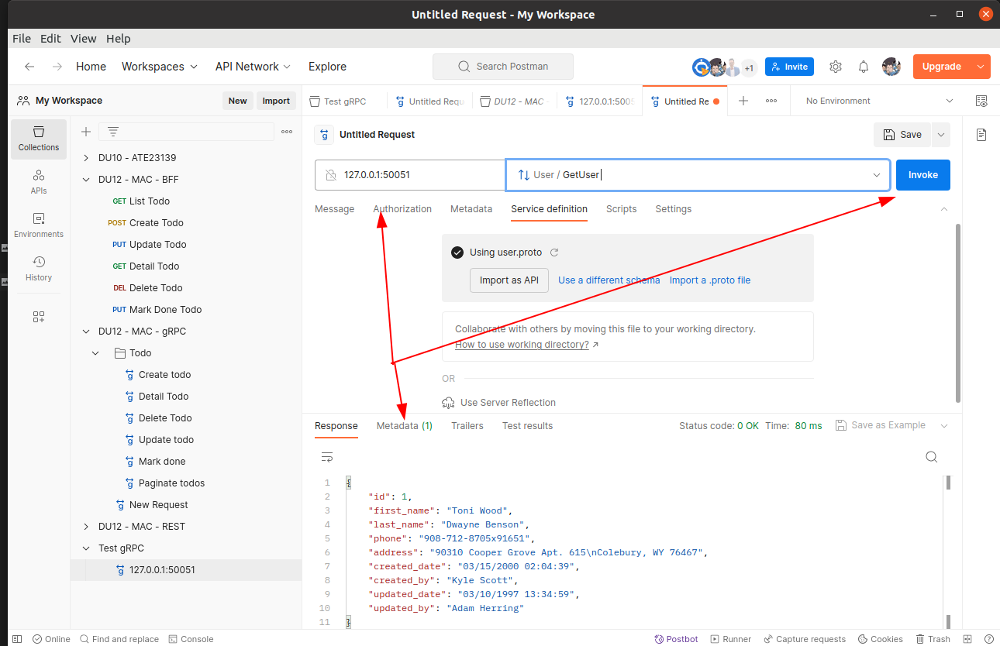

# gRPC protos

### Dự án demo cho microservices giữa 2 service bff-service và grpc-service

grpc-service có nhiệm vụ CRUD và làm lớp logic xử lý gRPC

bff-service có nhiệm vụ lấy dữ liệu gRPC từ grpc-service và convert nó về dạng json 
để phía Frontend có thể đọc được như 1 RestAPI bình thường

hiện grpc-service chỉ làm get list và get detail, chưa làm create, update, delete
bởi vì request và response của các phần kia giống nhau

### Lệnh generate protos file từ file `.protos`
```
cd service_name
python3 -m grpc_tools.protoc -I protos --python_out=protos --grpc_python_out=protos protos/user.proto
```

sau đó sửa ở file `user_pb2_grpc.py` của 2 services:
từ `import user_pb2 as user__pb2` thành `import protos.user_pb2 as user__pb2`

### Install step:
```
cd service_name
python3 -m venv venv
source venv/bin/activate
pip install -r requirements.txt
```

copy `.env.example` thành `.env`

### Start server
```
cd service_name
python3 main.py
```

### Dockerize
sửa `.env` từ `GRPC_SERVICE_URL=127.0.0.1:50051` thành `GRPC_SERVICE_URL=grpc:50051`

sau đó chạy:
```
docker-compose up -d
```

### Cách tạo postman collection cho gRPC

gRPC request không giống như RestAPI request, 
nó sẽ không thể để ở collection thông thường như RestAPI, 
mà nó cần để ở collection dành riêng

Để tạo gRPC collection, 
trước tiên cần tạo gRPC request trước 
sau đó mới `ctrl S` để nó hiện ra bảng chọn collection, 
sau đó tạo 1 collection mới và lưu vào.

Để tạo gRPC request, chọn New -> gRPC -> 
sang tab Service Definition -> Import .protos file -> chọn file -> ấn next ->
use without importing -> select a method -> nhập url -> ấn invoke




### Note:

Phải luôn up to date giữa 2 `.proto` file giữa 2 services, 
bởi nếu không, nó sẽ có thể sẽ return về `_MultiThreadedRendezvous` 
chứ không phải grpc response như bình thường

https://stackoverflow.com/a/77199118/8962929